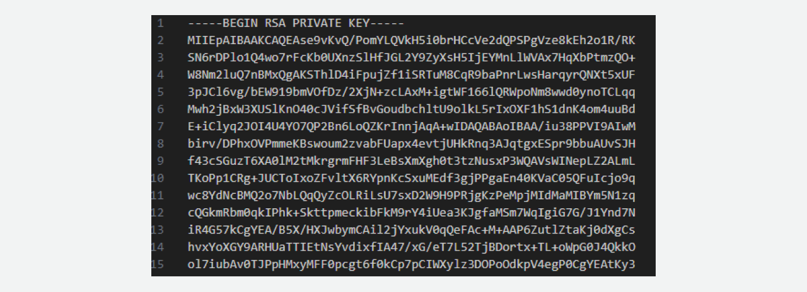
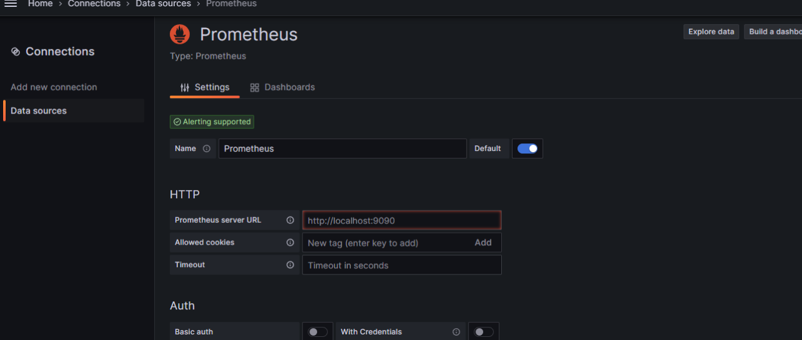

# Monitoring-aws-cloud-Infrastructure-with-ansible-Prometheus-and-grafana
This project demonstrates how to set up a comprehensive infrastructure monitoring system on Amazon Web Services (AWS) using Ansible for orchestration, Prometheus for metrics collection, and Grafana for data visualization. By following this guide, you can monitor the performance and health of your AWS instances in real time.

## Table of Contents

- [Installation and Setup](#installation-and-setup)
  - [Create EC2 Instance and Install Ansible](#create-ec2-instance-and-install-ansible)
  - [Install Prometheus and Grafana](#install-prometheus-and-grafana)
  - [Install and Configure Node Exporter](#install-and-configure-node-exporter)
  - [Create Grafana Dashboard](#create-grafana-dashboard)
- [Support](#support)

## Installation and Setup

### Create EC2 Instance and Install Ansible

#### Security Groups

**Master Node Security Group:**
- Open ports for SSH (22), Prometheus (9090), and Grafana (3000).

**Worker Node Security Group:**
- Open port for SSH (22) and Node Exporter (9100).

#### Creating Instances

Create a total of 3 instances (you can add more if needed):
- 1 Master/Controller Node (OS: Ubuntu)
- 2 Worker Nodes (OS: Ubuntu)

For the instance types:
- Use `t2.medium` for the Master/Controller Node.
- Use `t2.small` for the Worker Nodes.

#### Master Node User Data

When creating the Master/Controller Node, pass the following user data script. It will automatically install Ansible and create an Ansible playbook directory.

`#!/bin/bash
sudo apt update -y
sudo apt install ansible -y
sudo mkdir -p /home/ubuntu/ansible-playbook
sudo reboot`

#### Check Ansible Installation
SSH into the Master/Controller Node and verify that Ansible is installed.

`ansible --version` 

Now, your AWS instances are set up with the necessary security groups, and Ansible is installed on the Master/Controller Node for further configuration.

## Install prometheus and grafana
####Access the Ansible Playbook Directory and clone the GitHub Repository 
On the master node, you can use the following command to clone this repository.

`git clone https://github.com/Rumman-Octanex/Monitoring-Cloud-Infrastructure-with-ansible-Prometheus-and-grafana.git `

Now, copy all the files from the Monitoring-Cloud-Infrastructure-with-ansible-Prometheus-and-grafana directory to the ansible-playbook directory.

`sudo cp -r Monitoring-Cloud-Infrastructure-with-ansible-Prometheus-and-grafana/* ansible-playbook/`

####Run the Playbooks and Verify the installation
Execute the Prometheus playbook using the ansible-playbook command. For example:

`ansible-playbook install-prometheus.yaml`

After the Prometheus installation completes, execute the Grafana playbook similarly:

`ansible-playbook install-grafana.yaml`

Once both playbooks have run successfully, you can verify the installations. Access Prometheus by opening a web browser and navigating to the Prometheus URL using the appropriate port number, e.g., http://master-node-ip:9090.

Access Grafana by opening a web browser and navigating to the Grafana URL with the relevant port, typically http://master-node-ip:3000 . Ensure that both applications are working correctly.

##Install and configure node exporter
####Create SSH Key File and Edit the Inventory File
On your master node, create a file named __private_keys inside the ~/.ssh/  directory__. Save the private key of the .pem file you downloaded when creating the instances into the private_keys file.

Open the Ansible inventory file and add the public IP addresses of your worker nodes. The inventory file is typically named inventory. Run the __ping-server.yaml__ Ansible playbook to ensure that the master node can connect with the worker nodes.

`ansible-playbook -i inventory ping-server.yaml`

####Install and Verify Node Exporter
Run the __node-exporter.yaml__ Ansible playbook to install Node Exporter on the worker nodes.

`ansible-playbook -i inventory install-node-exporter.yaml`

Access each worker node by opening a web browser and navigating to the worker's URL using port 9100 __(e.g., http://worker-node-ip:9100)__. Ensure that Node Exporter is working properly.

####Edit Prometheus Configuration and Restart
Edit the Prometheus configuration file to include information(- targets) about your worker nodes. Located at __/opt/prometheus/prometheus-2.47.0-rc.0.linux-amd64/prometheus.yml.__

`scrape_configs:
- job_name: prometheus
  static_configs:
    - targets: ["localhost:9090"]
    - targets: ["worker-node-ip:9100"]
    - targets: ["worker-node-ip:9100"]`

Restart Prometheus to apply the configuration changes.

`sudo systemctl restart prometheus`

Access Prometheus by opening a web browser and check the status of worker nodes in Prometheus to ensure they are UP and collecting metrics.

##Create Grafana Dashboard
Use the default username and password, which is usually admin. Access Grafana via its web interface. Add Prometheus as a data source from connections.

Go to the "Create" section in Grafana. Choose "Dashboard" and then "Import. Import this (https://grafana.com/grafana/dashboards/1860-node-exporter-full/) pre-made dashboard from Grafana Labs, by pasting the JSON link, or you can create one from scratch based on your requirements.

Now, you can effectively monitor your worker nodes and share this information with others.

## Support
If you have any issues feel free to contact me via __rumman.octanex@gmail.com.__

